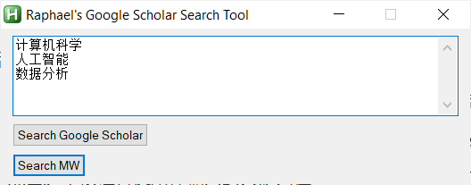

# Search-by-lines

一个经济又好用的项目，可以帮你批量搜单词/faculties啊之类的东西。
An economical and easy-to-use project that can help you batch search for words/faculty and the things similar.

## Raphael's Google Scholar Search Tool 使用指南

`SearchToolEvo.exe`这是一个自动搜索工具，用于在 Google Scholar 和 Merriam-Webster Thesaurus 上搜索关键词。

### 工具界面

当你运行`SearchToolEvo.exe`后，会看到一个简单的界面，包含以下元素：

- **搜索查询输入框**：这个文本框可以用于输入你想要搜索的关键词。每个关键词应该单独占据一行。

- **搜索 Google Scholar 按钮**：点击这个按钮将使用你输入的关键词在 Google Scholar 上进行搜索。

- **搜索 MW 按钮**：点击这个按钮将使用你输入的关键词在 Merriam-Webster Thesaurus 上进行搜索。

  

#### 使用步骤

1. 在搜索查询输入框中，每一行输入一个你想要搜索的关键词。例如：

   ```
   计算机科学
   人工智能
   数据分析
   ```

2. 选择你想要使用的搜索引擎：
   - 如果你想要在 **Google Scholar** 上搜索，点击 "Search Google Scholar" 按钮。
   - 如果你想要在 **Merriam-Webster Thesaurus** 上搜索，点击 "Search MW" 按钮。

3. 稍等片刻，工具会自动为你打开浏览器，并在选定的搜索引擎上执行搜索。每个关键词都会分别进行搜索。

#### 注意事项

- 工具会在每个关键词搜索之间暂停一秒钟，以确保搜索引擎有足够的时间来加载结果。你可以根据需要调整这个暂停时间。

- 如果你想要退出工具，可以点击窗口右上角的关闭按钮或使用 Alt+F4 快捷键。

享受使用这个工具来进行快速的学术和词汇检索吧！如果有任何问题或建议，欢迎反馈。
